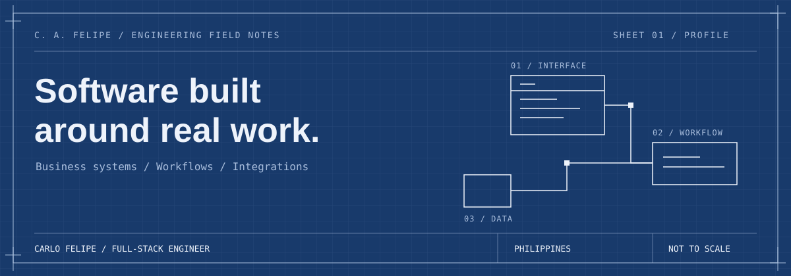

# I'm Carlo.

**Full-stack engineer building business systems, workflow automation, and integrations.**

Before I built software, I helped people troubleshoot it. That support-desk perspective still follows me into the code: who uses this, where can it fail, and what happens next?

[Explore the work ↗](https://carlofelipe.sistemaph.app/) · [Let's talk on LinkedIn ↗](https://www.linkedin.com/in/carlofelipe/) · [Notes on X ↗](https://x.com/crlofelipe)

---

### 01 / Selected systems

| System | What I worked on | The constraint that shaped it |
| :--- | :--- | :--- |
| **Enterprise management** | 35 modules, shared approval workflows, and SAP Business One integration for payment drafts and purchase orders. | Approval rules and permissions must hold across the whole system. |
| **Live-event operations** | Real-time attendance, QR pledges, and a category-aware raffle engine. | A fixed event date and a room full of real users. |
| **Multi-tenant HRIS** | Separate billing and tenant schemas, subscriptions, and audit logging. | Keeping each organization's data separate. |

*Client work is described without identifying the organization or exposing its internal code. More context and diagrams live in [my portfolio](https://carlofelipe.sistemaph.app/).*

### 02 / On the drawing board

> **SistemaPH · In development**  
> A business-software suite for local Philippine businesses, starting with HRIS. I'm working toward making useful business tools more accessible and affordable. It's still being built.

### 03 / Inside the systems

<strong>Open the engineering notes</strong> — workflows, boundaries, and integrations

#### A request has a lifecycle

An approval flow needs more than an approve button. My enterprise work includes delegation, stage-gated edit permissions, rejection history, and bulk operations across multiple form types.

#### Integrations need to finish the job

The SAP Business One Service Layer connects application workflows to payment drafts and purchase orders. I work on the path from a user's request to the record it creates in the ERP.

#### Boundaries belong in the data model

My HRIS work separates organizations, invoices, subscriptions, and audit logs from tenant data such as employees, departments, and salary history. The schema boundary is a deliberate part of the design.

<strong>Open the tool drawer</strong> — the stack behind the work

| Layer | Tools |
| :--- | :--- |
| Interfaces | TypeScript, React, Next.js, Tailwind CSS |
| APIs and workflows | Node.js, NestJS, n8n |
| Data | PostgreSQL, Prisma, Supabase |
| Integrations and operations | SAP Business One Service Layer, Sentry, Nodemailer, pdf-lib |

### 04 / From the other side of the ticket

Customer support at Teleperformance and TaskUs. Player support at Keywords Studios. Support automation with Intercom and Fin AI at Billo. Now, full-stack engineering and technical leadership on client systems.

The through-line is the same: understand the problem well enough to make the next person's work easier.

Away from the keyboard: travel and competitive games.

---

**Have a business workflow that needs better software?**  
I'm open to client projects and long-term engineering contracts. [Tell me what you're building →](https://www.linkedin.com/in/carlofelipe/)
